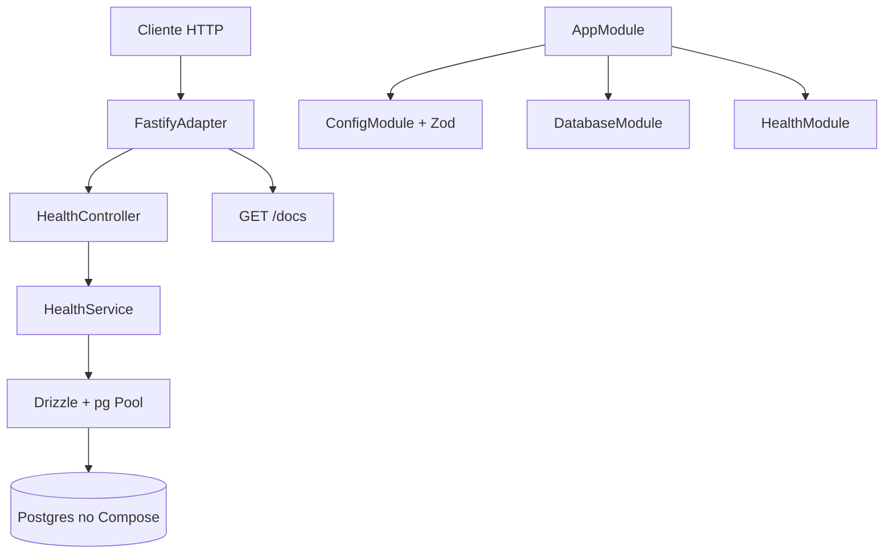

# API Bootstrap Design

**Spec**: `.specs/features/api-bootstrap/spec.md`
**Status**: Approved

---

## Architecture Overview

O finance-up é dois projetos. Este repositório é só a API. O frontend fica em `finance-up-web` e entra depois.

A API é um processo NestJS 12. O HTTP é Fastify. Módulos internos separam config, banco e health. O próximo domínio entra como módulo novo, sem mudar o adapter HTTP.

---

## Code Reuse Analysis

### Existing Components to Leverage

| Component | Location | How to Use |
| --- | --- | --- |
| Nenhum | — | Repositório vazio além de `.specs/` |

### Integration Points

| System | Integration Method |
| --- | --- |
| Postgres | `DATABASE_URL` no env, pool `pg`, Drizzle `node-postgres` |
| OpenAPI | `SwaggerModule.setup('docs')` no Fastify; Zod 4.6 via `~standard.jsonSchema` |
| Frontend futuro | Consome o documento em `/docs-json`; fora deste corte |

---

## Components

### Bootstrap

- **Purpose**: Sobe Fastify, valida env antes do listen, monta OpenAPI.
- **Location**: `src/main.ts`, `src/setup-app.ts`
- **Interfaces**:
  - `setupApp(app: NestFastifyApplication): void`
  - `bootstrap(): Promise<void>`
- **Dependencies**: `@nestjs/platform-fastify`, `@fastify/static`, `@nestjs/swagger`
- **Reuses**: CLI Nest 12 ESM

### Config

- **Purpose**: Recusa boot se `DATABASE_URL` estiver ausente.
- **Location**: `src/config/env.schema.ts`
- **Interfaces**:
  - `envSchema` — Zod object com `NODE_ENV`, `PORT`, `DATABASE_URL`
- **Dependencies**: `zod`, `@nestjs/config`
- **Reuses**: `ConfigModule.forRoot({ validationSchema })`

### Database

- **Purpose**: Expõe um cliente Drizzle a partir de `DATABASE_URL`.
- **Location**: `src/database/database.module.ts`, `src/database/schema/index.ts`
- **Interfaces**:
  - token `DRIZZLE` — `NodePgDatabase`
- **Dependencies**: `drizzle-orm`, `pg`
- **Reuses**: nenhum schema de domínio; `select 1` é a única query deste corte

### Health

- **Purpose**: Responde o contrato de saúde do spec.
- **Location**: `src/health/`
- **Interfaces**:
  - `GET /health` → `200 { status: "ok", database: "up" }` ou `503 { status: "error", database: "down" }`
- **Dependencies**: `DRIZZLE`
- **Reuses**: `sql` do Drizzle para `select 1`

### Compose

- **Purpose**: Postgres local alinhado ao `.env.example`.
- **Location**: `docker-compose.yml`, `.env.example`
- **Interfaces**: usuário, senha, database e porta do compose iguais aos da `DATABASE_URL` de exemplo
- **Dependencies**: Docker
- **Reuses**: nenhum

---

## Data Models (if applicable)

Nenhuma tabela neste corte. `src/database/schema/index.ts` exporta um objeto vazio para o drizzle-kit ter um arquivo de schema.

---

## Error Handling Strategy

| Error Scenario | Handling | User Impact |
| --- | --- | --- |
| Env inválido | `ConfigModule` lança no init, antes de `listen` | Processo encerra com código diferente de zero |
| Postgres inacessível | Health captura o erro da query | `503` com `{ status: "error", database: "down" }` |
| Porta HTTP ocupada | `listen` propaga `EADDRINUSE` | Processo encerra com o erro do Node |

O pool usa `connectionTimeoutMillis: 2000` para o health não pendurar quando o host não responde.

---

## Risks & Concerns

| Concern | Location (file:line) | Impact | Mitigation |
| --- | --- | --- | --- |
| `nestjs-zod` sem peer para Nest 12 | n/a — pacote não entra | Validação quebraria no upgrade | Zod nativo do Nest 12 + Swagger |
| Diretório já tem `.specs/` | raiz | `nest new` recusa diretório não vazio | Scaffold em diretório temporário e cópia para cá |
| Swagger no Fastify precisa de static | `src/setup-app.ts` | UI em `/docs` não abre | Dependência `@fastify/static`, exigida pela doc do Nest |

---

## Tech Decisions (only non-obvious ones)

| Decision | Choice | Rationale |
| --- | --- | --- |
| Adapter HTTP | Fastify | Pedido do usuário |
| Limite do repositório | Só API | Frontend é outro projeto |
| OpenAPI | `@nestjs/swagger` direto no Zod 4.6 | Doc do Nest: Zod 4.2+ já expõe JSON Schema |
| Falha de banco | 503 no health, processo vivo | Spec BOOT-03 |

> **Project-level decisions:** registradas em `.specs/STATE.md` como AD-001 a AD-004.
