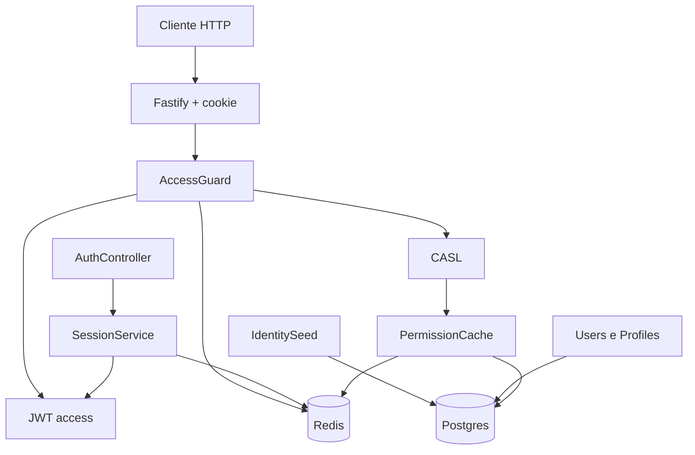

# Auth Access Design

**Spec**: `.specs/features/auth-access/spec.md`
**Status**: Approved

## Architecture

Postgres é a fonte de usuários, perfis e permissões. Redis guarda só o que expira: blacklist do `jti`, refresh opaco e cache de permissões por 60 segundos.

## Redis

Cliente `ioredis`, conexão preguiçosa, sem retentativa. Falha de comando vira HTTP 503 com `Redis indisponível`. O processo continua no ar. `REDIS_URL` ausente falha no Zod antes do `listen`.

| Chave | Valor | TTL |
| --- | --- | --- |
| `auth:blacklist:{jti}` | `1` | até o `exp` do access |
| `auth:refresh:{sha256}` | id do usuário | 7 dias |
| `auth:perms:{userId}` | JSON das chaves | 60 segundos |

O cookie `refresh_token` é `httpOnly`, `Path=/auth`, `SameSite=Lax`. `Secure` só em production. O valor do cookie é aleatório; o Redis guarda o hash.

## Autorização

O catálogo em `permission-catalog.ts` alimenta o seed. O perfil Admin recebe todas as chaves. O perfil Usuario não recebe chave de administração. `defineAbilityFor` sempre permite ler e atualizar o próprio usuário. Rotas de administração exigem regra CASL sem condição, para o acesso ao próprio usuário não liberar `/users`.

## Boot

`IdentitySeedService` aplica as migrations do Drizzle e semeia permissões e perfis de sistema. O admin do ambiente só é criado quando `users` está vazia. Se o Postgres não aceita conexão, o seed registra o erro e o processo sobe; `GET /health` segue respondendo 503 sem incluir o Redis no corpo.
